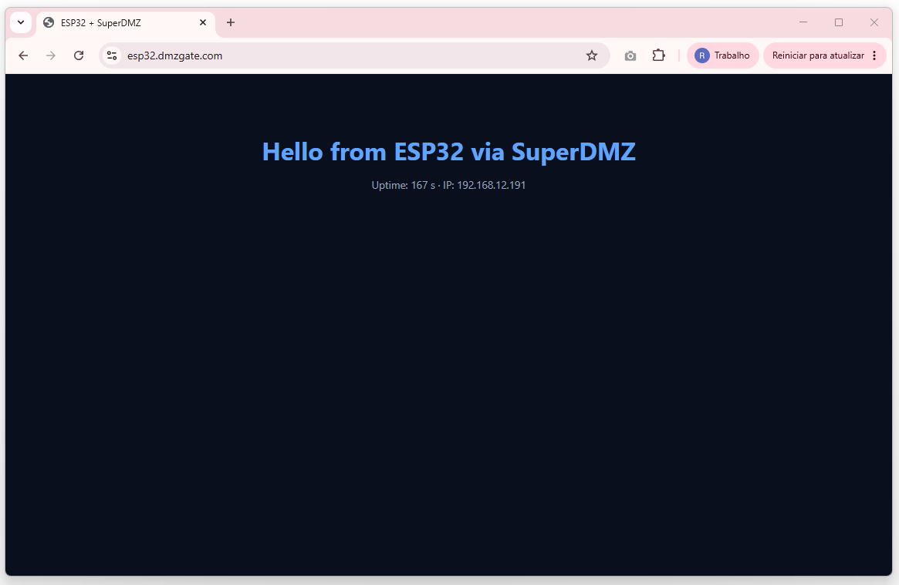
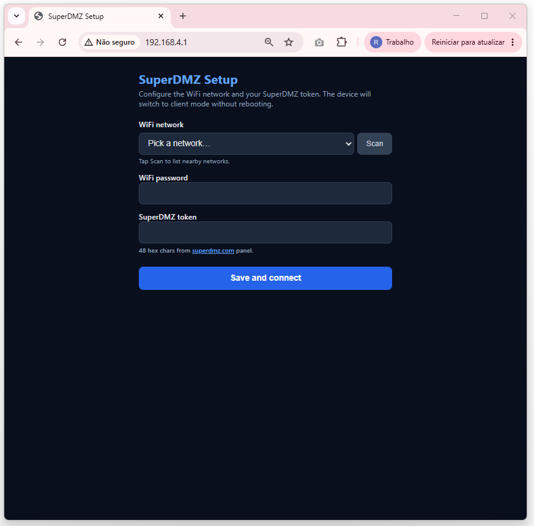
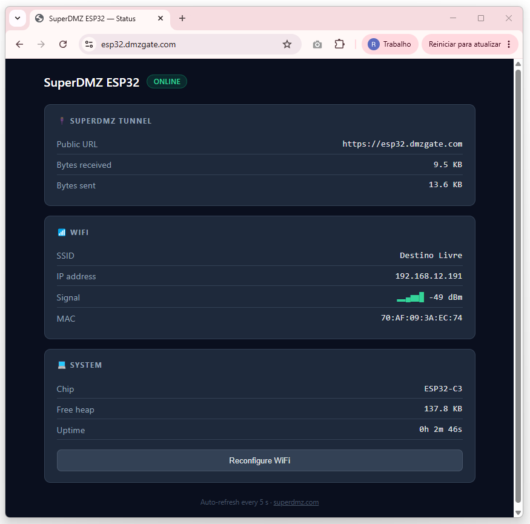
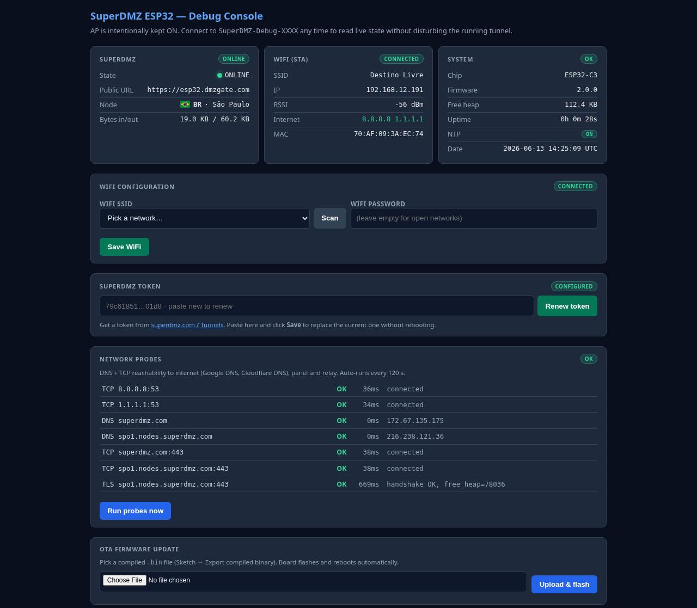

# SuperDMZ para Arduino (ESP32)

Expõe o WebServer do seu ESP32 em uma URL pública `https://<seu-host>.dmzgate.com` — sem IP fixo, sem abrir porta no roteador, sem configurar DNS dinâmico.

A biblioteca abre uma conexão WSS (WebSocket TLS) outbound pra um node SuperDMZ, faz multiplexação de requests sobre essa conexão e encaminha tudo pro seu WebServer local. TLS é terminado no node (cert Let's Encrypt válido pra `*.dmzgate.com`).

## Compatibilidade

| Chip | Status |
|------|--------|
| ESP32 (ESP32-WROOM-32, WROVER) | ✅ Suportado |
| ESP32-S2 | ✅ Suportado |
| ESP32-S3 | ✅ Suportado |
| ESP32-C3 | ✅ Suportado |
| ESP32-C6 | ✅ Suportado |
| Arduino Nano ESP32 | ✅ Suportado (é um ESP32-S3 em formato Nano) |

Framework: **Arduino-ESP32 core 2.0.14+** ou **3.0+**. Testado com Arduino IDE 2.x e PlatformIO.

## Instalação

### Arduino IDE
1. `Sketch` → `Include Library` → `Manage Libraries…`
2. Procure por **SuperDMZ** → `Install`
3. Dependências (são instaladas no mesmo prompt): **WebSockets** by Markus Sattler e **ArduinoJson** by Benoit Blanchon.

Ou instalação manual:
1. Baixe o ZIP em [github.com/superdmz/SuperDMZ-Arduino/releases](https://github.com/superdmz/SuperDMZ-Arduino/releases)
2. `Sketch` → `Include Library` → `Add .ZIP Library…`

### PlatformIO
```ini
lib_deps =
    superdmz/SuperDMZ@^1.1.3
```

## Uso mínimo

```cpp
#include <WiFi.h>
#include <WebServer.h>
#include <SuperDMZ.h>

WebServer server(80);
SuperDMZ  tunnel;

void setup() {
  WiFi.begin("SUA_REDE", "SUA_SENHA");
  while (WiFi.status() != WL_CONNECTED) delay(200);

  server.on("/", [](){ server.send(200, "text/html", "Hello"); });
  server.begin();

  tunnel.begin("SEU_TOKEN_48_HEX", 80);   // 80 = porta do WebServer (= local_port do tunnel)
}

void loop() {
  server.handleClient();
  tunnel.loop();
}
```

## API

```cpp
bool begin(const char* token, uint16_t localPort, const char* node = "");
```
Inicia o tunnel. `token` é o de 48 hex chars do painel. `localPort` é a porta do seu WebServer **e precisa bater** com o `local_port` configurado no tunnel pelo painel. `node` é opcional — se omitido, a lib consulta o painel pra descobrir o melhor node.

```cpp
void loop();
```
Chame em todo `loop()`. Mantém WSS vivo, processa requests, gerencia reconnect, ping/pong.

```cpp
void onStatus(void (*cb)(bool online, const char* publicUrl));
```
Callback chamado quando o tunnel sobe/cai.

```cpp
bool isOnline();
const char* publicUrl();
uint32_t bytesIn();
uint32_t bytesOut();
```
Telemetria pra mostrar status no seu próprio dashboard / OLED.

```cpp
void reconnect();
```
Força reconexão. Raramente necessário — auto-reconnect já cobre quase tudo.

## Limites e considerações

- **Conexões concorrentes**: ESP32 vanilla (sem PSRAM) aguenta ~3 requests HTTP simultâneos. Com PSRAM, ~10. Acima disso o mbedtls começa a ficar sem heap.
- **WiFi precisa estar UP**: chame `tunnel.begin()` só depois que `WiFi.status() == WL_CONNECTED`. A lib detecta WiFi caindo e reconecta sozinha.
- **Cert chain TLS**: a lib confia em qualquer cert TLS do node (lado outbound). O TLS termina no node, não no ESP, então a CA do tunnel é pública (Let's Encrypt) mas a verificação é simplificada pra economizar heap.

## Como compilar os exemplos (passo a passo)

Estes exemplos foram **desenvolvidos e validados no ESP32-C3 Super Mini** (4 MB flash, 400 KB RAM, single-core RISC-V). Devem funcionar em qualquer chip da família ESP32 (ver tabela de compatibilidade no topo), mas se algo der diferente, é provavelmente fragmentação de heap ou partition layout — começa lendo as observações abaixo.

### 1. Configuração no Arduino IDE

1. **Tools → Board → ESP32 Arduino → "ESP32C3 Dev Module"** (ou outro chip ESP32 que você tenha).
2. **Tools → CPU Frequency → 160 MHz** (default; não precisa mudar).
3. **Tools → Flash Size → 4MB (32Mb)**.
4. **Tools → Partition Scheme**:
   - Pra **HelloWorld** e **ProvisioningPortal** — **Default 4MB with spiffs (1.2MB APP / 1.5MB SPIFFS)** funciona.
   - Pra **SmartIoT-Debug** — escolha **"Minimal SPIFFS (1.9MB APP with OTA / 190KB SPIFFS)"**. O sketch é grande (~970 linhas + PROGMEM de 18 KB do HTML do dashboard) e usa o feature de OTA — precisa das duas partições App0/App1 e da 1.9 MB de espaço útil.
5. **Tools → USB CDC On Boot → Enabled** (necessário no ESP32-C3/S3 pra ver `Serial.print` via USB nativo). Em chips com chip USB→UART externo (ESP32 clássico) pode ignorar.
6. **Tools → Erase All Flash Before Sketch Upload → Disabled** (default; só ative se quiser resetar a NVS junto com o firmware).

### 2. Credenciais

- **HelloWorld** — edita as 3 linhas no início do `.ino` (linhas 17-19): `WIFI_SSID`, `WIFI_PASS`, `SUPERDMZ_TOKEN`. O token sai do painel SuperDMZ ao criar um tunnel HTTP.
- **ProvisioningPortal** e **SmartIoT-Debug** — não edita nada. Tudo é configurado no AP captive portal `SuperDMZ-Setup-XXXX` (senha `12345678`) que sobe no primeiro boot.

### 3. Flash e teste

1. Conecta o board no USB.
2. **Tools → Port** → seleciona a porta do board.
3. **Sketch → Upload** (ou ⌘U / Ctrl+U).
4. **Tools → Serial Monitor** → 115200 baud, "Both NL & CR".
5. Reset o board (botão RST). Você deve ver logs `[boot]`, `[wifi]`, `[SuperDMZ]`.

### Observações operacionais

- **`Multiple libraries were found for "WiFi.h"`** durante o build — é **informativo, não erro**. O compilador escolhe corretamente o WiFi do ESP32 Arduino core e ignora os de outras famílias (WiFiNINA, WiFiEspAT). Pode deixar como está.
- **Não rode o sketch sem `tunnel.loop()` no `loop()`** — caso contrário o tunnel reconecta indefinidamente. (Ver bug structurel da v1.2.0 abortada no CHANGELOG.)
- **HTML grande (>10 KB) servido via tunnel** — o `WebServer.send_P()` do Arduino-ESP32 bloqueia em `client.write()` quando o buffer loopback (~5 KB) enche. O `pumpLocalToWs()` da lib não consegue drenar porque o `loop()` está parado dentro do handler. Solução: stream em chunks chamando `tunnel.loop()` entre cada chunk de 1 KB. Veja `handleRoot()` do SmartIoT-Debug — é o padrão.

## Exemplos incluídos

Três exemplos, do "10 linhas pra testar" até o "Swiss Army knife com tudo":

### 1. HelloWorld — quick start mínimo

`WebServer.h` básico, página estática, credenciais hardcoded. Lê em 1 min, roda em 5. Bom pra primeiro contato com a lib.



### 2. ProvisioningPortal — production template

Captive portal pro cliente final configurar WiFi + token **sem rebuild**, scan de redes, NVS persistente, status dashboard servida pelo tunnel, botão GPIO0 (3 s reconfig WiFi / 10 s factory reset), transição AP↔STA sem reboot.

| Captive portal (modo AP) | Dashboard (modo STA) |
|---|---|
|  |  |

### 3. SmartIoT-Debug — completo + debug

Superset do ProvisioningPortal + ring log de 80 linhas em RAM (visualizável em `/log` e no dashboard), probes de rede (DNS + TCP + TLS a Google DNS e Cloudflare DNS), card de Internet com indicador verde/vermelho por provider, NTP com data UTC, OTA via dashboard (upload de `.bin` com barra de progresso), troca de token sem reboot, info do node (bandeira + cidade puxados do painel SuperDMZ).



> **Nota sobre `.h` separado**: o `SmartIoT-Debug.ino` usa `#include "debug_html.h"` pra manter o HTML/JS do dashboard num arquivo separado. **É obrigatório.** O prototype generator do Arduino IDE 3.x interpreta o JavaScript dentro do `R"HTML(...)HTML"` como código C++ e quebra com `'function' does not name a type`. Headers `.h` escapam desse pipeline.

## Licença

MIT. Veja [LICENSE](LICENSE).

## Suporte

- Painel: [superdmz.com/login/](https://superdmz.com/login/)
- Manual completo: [superdmz.com/login/?page=installer#esp32-manual](https://superdmz.com/login/?page=installer#esp32-manual)
- Issues: [github.com/superdmz/SuperDMZ-Arduino/issues](https://github.com/superdmz/SuperDMZ-Arduino/issues)
